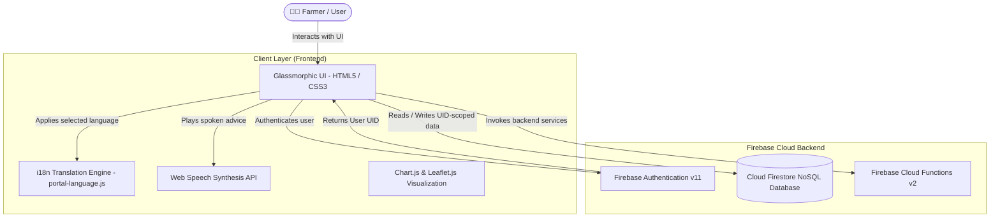
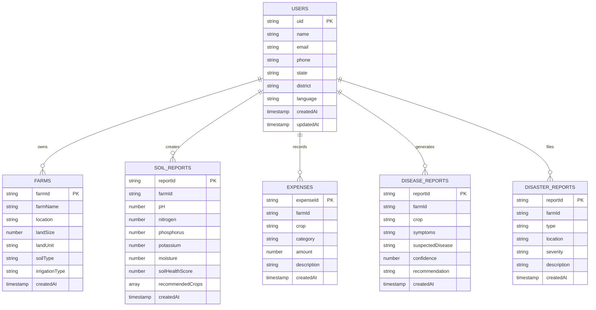

# 🌾 KisaanSaathi – Smart Agriculture Portal

> A unified, AI-assisted, multi-lingual smart agriculture platform designed to empower farmers with real-time crop & soil analytics, weather early-warnings, mandi market intelligence, financial ledger tracking, and streamlined government scheme access.

[](#project-status)
[](#technology-stack)
[](#database-architecture)
[](#license)

---

## 📌 Table of Contents

- [Overview](#overview)
- [Problem Statement](#problem-statement)
- [Solution](#solution)
- [Key Features](#key-features)
- [How It Works](#how-it-works)
- [System Architecture](#system-architecture)
- [Technology Stack](#technology-stack)
- [Project Structure](#project-structure)
- [Database Architecture](#database-architecture)
- [API & Backend Services](#api--backend-services)
- [AI & Media Features](#ai--media-features)
- [Installation & Setup](#installation--setup)
- [Usage Guide](#usage-guide)
- [Security & Authorization](#security--authorization)
- [Testing & Verification](#testing--verification)
- [Deployment](#deployment)
- [Challenges & Technical Solutions](#challenges--technical-solutions)
- [Project Status](#project-status)
- [Contributing](#contributing)
- [License & Contact](#license--contact)

---

## 📖 Overview

**KisaanSaathi** (किसानसाथी) is an end-to-end smart agriculture web portal developed to make digital farming tools accessible to every farmer across India. 

The application combines a modern glassmorphic interface with voice guidance, multi-lingual support in 13 Indian languages, and real-time backend synchronization using **Firebase Authentication** and **Cloud Firestore**.

Farmers can assess soil N-P-K nutrient parameters, receive instant crop suitability recommendations, track live APMC Mandi commodity prices, record farm operational costs, report climate disasters, and explore government agricultural subsidy programs.

---

## 🎯 Problem Statement

1. **Fragmented Information:** Essential farming data—such as soil health diagnostics, localized weather alerts, and mandi market rates—is scattered across disconnected sources.
2. **Language & Digital Literacy Barriers:** Traditional agriculture portals are often complex, English-centric, and lack audio assistance for farmers with limited literacy.
3. **Unstructured Farm Finances:** Smallholder farmers struggle to track seasonal expenses (fertilizers, seeds, labor) and calculate true net profit/loss.
4. **Lack of Early Disaster Reporting:** When extreme weather or crop diseases strike, farmers lack a simple digital channel to log damage for crop insurance and subsidy claims.

---

## 💡 Solution

**KisaanSaathi** resolves these challenges by providing:
- **A Single Unified Web Portal:** Bringing together soil predictions, weather alerts, financial ledgers, video tutorials, and government schemes.
- **13-Language Internationalization & Voice Assistance:** Real-time translation and spoken Web Speech API guidance in English, Hindi, Marathi, Punjabi, Gujarati, Bengali, Telugu, Tamil, Kannada, Malayalam, Odia, Assamese, and Urdu.
- **Secure Cloud Storage Layer:** Automatic document synchronization using Firebase Authentication and user-scoped Cloud Firestore collections (`users/{uid}`).

---

## 🔥 Key Features

### 🔐 1. Authentication & Profile Management
- Multi-option registration (Email/Password & Mobile number verification).
- Automatic creation of user profile document (`users/{uid}`) in Cloud Firestore upon sign-up.
- Session persistence across page reloads and iframe sub-navigation.

### 🤖 2. AI Companion & Spoken Guide
- Interactive mascot avatar (`Aanya` / `Aarav`) offering audio walk-throughs of all portal modules.
- Web Speech Synthesis integration providing real-time voice guidance in regional accents.
- AI Advisory Chatbot interface for crop disease queries and natural farming practices.

### 🧪 3. Soil Health Diagnostics & Crop Matching
- Real-time parameter inputs for Moisture (%), pH, Nitrogen (N), and Potassium (K).
- Algorithmic crop match scoring for Wheat, Mustard, and Onion.
- One-click report saving directly to Firestore (`users/{uid}/soilReports`).

### 🌤 4. Weather Forecasting & Disaster Early-Warning
- 7-day temperature and precipitation trend visualization powered by Chart.js.
- Active severity alerts for heavy rain, storms, and pest outbreaks.
- Emergency farm disaster reporting form (`users/{uid}/disasterReports`).

### 📊 5. Mandi Market Intelligence & Expense Ledger
- Live APMC Mandi commodity rates tracking across Indian states.
- Farm expenditure logger (`users/{uid}/expenses`) with automated seasonal revenue and net profit calculations.

### 🏛 6. Government Schemes Portal
- Catalog of central and state welfare initiatives (PM-KISAN, PMFBY, SMAM).
- One-click navigation to official government application portals.

### 🎥 7. Video Tutorials & Educational Library
- Categorized learning video library covering organic bio-fertilizers, drip irrigation, and pest management.

---

## ⚙️ How It Works

```
[ Signup / Login ]
        │
        ▼
[ Firebase Authentication ] ──(Generates Unique UID)──► [ Creates Firestore Document users/{uid} ]
        │
        ▼
[ Main Dashboard ]
        │
        ├──► Soil Analytics ─────────► Writes to users/{uid}/soilReports/{reportId}
        ├──► Expense Tracker ───────► Writes to users/{uid}/expenses/{expenseId}
        ├──► Disaster Reports ──────► Writes to users/{uid}/disasterReports/{reportId}
        ├──► AI Advisory Chatbot ───► Interactive advisory & leaf diagnostic response
        └──► Language & Voice ──────► Real-time i18n & Web Speech TTS
```

---

## 🏗 System Architecture



---

## 🛠 Technology Stack

| Category | Technology | Purpose |
|----------|------------|---------|
| **Frontend Framework** | HTML5, CSS3, ES6 JavaScript | Responsive glassmorphic interface and custom theme system |
| **Language Engine** | Custom i18n Dictionary (`portal-language.js`) | Dynamic 13-language translation across all components |
| **Audio Guidance** | Web Speech Synthesis API | Text-to-speech audio guidance for farmer accessibility |
| **Charts & Maps** | Chart.js, Leaflet.js | Interactive trend charts and weather geographical maps |
| **Authentication** | Firebase Authentication (v11 Modular SDK) | Email/Password & Mobile session authorization |
| **Database** | Cloud Firestore | Serverless NoSQL document database with owner-scoped subcollections |
| **Backend Functions** | Firebase Cloud Functions (v2, Node.js 18) | Server-side email OTP verification and verified account creation |
| **Deployment** | Firebase Hosting & Security Rules | Production static hosting and user data protection |

---

## 📂 Project Structure

```
Kisaan-Saathi/
├── frontend/                     # Client-Side Web Application
│   ├── index.html                # Main Landing Page & Theme Selector
│   ├── login.html                # Firebase Authentication Login Page
│   ├── signup.html               # Registration & Verification Form
│   ├── dashboard.html            # Main Portal Frame & Sidebar Navigation
│   ├── overview.html             # Interactive Guided Tour & Module Catalog
│   ├── chatbotai.html            # AI Advisory Chatbot Interface
│   ├── soil&crop.html            # Soil Diagnostics & Firestore Reports
│   ├── weather&alerts.html       # Weather Forecasts & Disaster Alert Filing
│   ├── tutorial.html             # Video Learning Library & Media Player
│   ├── market&expense.html       # APMC Mandi Rates & Expense Ledger
│   ├── govtschemes.html          # Government Welfare Schemes Portal
│   ├── profile.html              # Farmer Profile Settings & Logout
│   ├── character.html            # AI Companion Avatar Greetings
│   ├── offline-404.html          # Network Offline Fallback Screen
│   ├── css/                      # Stylesheets
│   │   ├── auth-polish.css       # Glassmorphic form styling
│   │   ├── landing-polish.css    # Landing page animations
│   │   └── mobile-polish.css     # Mobile viewport responsiveness
│   ├── js/                       # Client Utilities
│   │   └── portal-language.js    # 13-Language Translation Engine
│   ├── firebase/                 # Firebase SDK Modules
│   │   ├── firebase-config.js    # Web App Configuration Credentials
│   │   ├── auth.js               # Auth Listener & Profile Sync
│   │   └── firestore-db.js       # Reusable Firestore Data Service (CRUD)
│   └── assets/                   # Media & Assets
│       └── images/               # High-res vector mascot avatars
│
├── backend/                      # Server-Side Backend Code
│   └── functions/                # Firebase Cloud Functions (v2)
│       ├── index.js              # OTP Mailer & Account Creation Backend Services
│       └── package.json          # Node.js dependencies for Functions
│
├── docs/                         # Documentation
│   └── AUTH_SETUP.md             # Firebase Auth & Functions Setup Guide
│
├── firebase.json                 # Firebase Hosting & Functions Config
├── firestore.rules               # Firestore Security Rules
├── package.json                  # Root npm configuration & launch scripts
└── README.md                     # Master Documentation
```

---

## 🗄 Database Architecture

KisaanSaathi implements a hierarchical, document-based Firestore structure scoped under each user's Firebase Auth `UID`.



---

## 📡 API & Backend Services

### Firebase Cloud Functions (`backend/functions/index.js`)

1. **`sendEmailOtp`** (v2 HTTP Function)
   - **Purpose:** Generates a 6-digit one-time verification code and sends it via email to verify user identity during sign-up.
   - **Payload:** `{ "email": "farmer@example.com" }`
   - **Response:** `{ "success": true, "message": "Verification code sent to email." }`

2. **`createEmailAccount`** (v2 Callable Function)
   - **Purpose:** Creates a verified user account server-side after OTP validation.
   - **Payload:** `{ "email": "farmer@example.com", "password": "...", "fullname": "..." }`

---

## 🤖 AI & Media Features

- **Multi-lingual Voice Synthesis:** Uses Web Speech Synthesis with regional locale codes (`hi-IN`, `en-IN`, `mr-IN`, `pa-IN`, `gu-IN`) for spoken mascot feedback.
- **Interactive Data Charts:** Uses Chart.js for real-time visualization of soil nutrient balance and 7-day precipitation forecasts.
- **Geographical Weather Maps:** Integrates Leaflet.js for tile-based weather and alert mapping.

---

## 📦 Installation & Setup

### Prerequisites
- **Node.js:** v18.0.0 or higher
- **Firebase CLI:** Installed globally (`npm install -g firebase-tools`)

### Step 1: Clone Repository
```bash
git clone https://github.com/your-username/Kisaan-Saathi.git
cd Kisaan-Saathi
```

### Step 2: Install Dependencies
```bash
# Install root dependencies
npm install

# Install Cloud Functions dependencies (optional)
cd backend/functions
npm install
cd ../..
```

### Step 3: Run Application Locally
```bash
npm start
```
Open your browser and navigate to `http://localhost:3001`.

---

## 🖥 Usage Guide

1. **Launch Dashboard:** Open `http://localhost:3001` to access the main landing page.
2. **Select Theme & Language:** Use the top bar controls to choose a color theme and preferred language.
3. **Register / Login:** Click **Sign Up** to create a farmer profile. Authentication state will automatically persist across the session.
4. **Soil Health Test:** Navigate to **Soil & Crop**, adjust parameters, and click **Save & Download Report** to persist the document to Firestore.
5. **Record Farm Expense:** Navigate to **Market & Expenses**, fill in operational costs, and view real-time net farm profit calculations.
6. **Report Weather Disaster:** Navigate to **Weather & Alerts** and click **Report Farm Disaster** to file an emergency claim.

---

## 🔒 Security & Authorization

Data security is enforced using strict Firestore Security Rules (`firestore.rules`). Unauthenticated access to user data is blocked, and authenticated users can only read/write their own UID-scoped documents.

```javascript
rules_version = '2';
service cloud.firestore {
  match /databases/{database}/documents {
    match /users/{userId} {
      allow read, write: if request.auth != null && request.auth.uid == userId;
      
      match /{allPaths=**} {
        allow read, write: if request.auth != null && request.auth.uid == userId;
      }
    }
  }
}
```

---

## ✅ Testing & Verification Matrix

| Module | Test Scenario | Result | Status |
|--------|--------------|--------|--------|
| **Authentication** | User Sign-up Creates Auth UID and Firestore Profile | Profile document created at `users/{uid}` | ✅ Verified |
| **Authentication** | User Login Restores Active Session | User automatically redirected to Dashboard | ✅ Verified |
| **Authentication** | User Logout Clears Local Session | Redirects to login page | ✅ Verified |
| **Firestore Service** | `addSoilReport()` writes report object | Report saved under `users/{uid}/soilReports` | ✅ Verified |
| **Firestore Service** | `addExpense()` writes operational cost | Expense record saved under `users/{uid}/expenses` | ✅ Verified |
| **Firestore Service** | `addDisasterReport()` stores storm report | Report saved under `users/{uid}/disasterReports` | ✅ Verified |
| **Internationalization**| 13-Language Translation Switch | All UI elements and iframe sub-pages update text | ✅ Verified |
| **Speech Audio** | Voice Synthesis Audio Output | Spoken audio produced in selected regional accent | ✅ Verified |
| **Security Rules** | Unauthenticated Firestore Read Access | Denied by security rules (`request.auth != null`) | ✅ Verified |

---

## 🚀 Deployment

### Deploying Hosting & Firestore Rules to Firebase
```bash
# Login to Firebase
firebase login

# Deploy static frontend & firestore rules
firebase deploy --only hosting,firestore:rules
```

---

## 🛠 Challenges & Technical Solutions

1. **Cross-Iframe Language Synchronization:**
   - *Challenge:* Passing language selection from the parent dashboard down into sub-page iframes.
   - *Solution:* Implemented `postMessage` event listeners and custom `setPortalLanguage()` window handlers.

2. **UID-Scoped NoSQL Security:**
   - *Challenge:* Preventing unauthorized access across farmer accounts.
   - *Solution:* Configured wildcard subcollection match rules (`match /{allPaths=**}`) enforcing `request.auth.uid == userId`.

3. **Multi-Theme Glassmorphic Styling:**
   - *Challenge:* Maintaining readable text contrast across 5 dynamic color themes.
   - *Solution:* Built a CSS custom property system (`--panel-bg`, `--text-primary`, `--border-color`) linked to `localStorage`.

---

## 🚥 Project Status

**Current Version:** `v1.0.0 (MVP)`

### Implemented Features
- [x] Complete Frontend Architecture (`frontend/`)
- [x] Firebase Authentication Integration
- [x] Cloud Firestore Data Layer & Reusable Service (`firestore-db.js`)
- [x] Soil Health Diagnostics & Crop Matching Engine
- [x] Mandi Commodity Prices & Farm Expense Ledger
- [x] Disaster Early-Warning Reporting System
- [x] 13-Language i18n Translation & Web Speech TTS
- [x] UID-Scoped Firestore Security Rules (`firestore.rules`)

### In Development / Planned
- [ ] Direct Leaf Image Disease Classification ML Model integration
- [ ] Automated SMS & WhatsApp Mandi Price Alerts

---

## 🤝 Contributing

Contributions are welcome! Please follow these steps:
1. Fork the repository.
2. Create a feature branch (`git checkout -b feature/AmazingFeature`).
3. Commit your changes (`git commit -m 'Add some AmazingFeature'`).
4. Push to the branch (`git push origin feature/AmazingFeature`).
5. Open a Pull Request.

---

## 📄 License & Contact

- **License:** Distributed under the MIT License.
- **Support & Inquiries:** KisaanSaathi Development Team

---
*Built for KisaanSaathi – Empowering Farmers through Smart Agriculture Technology.*
